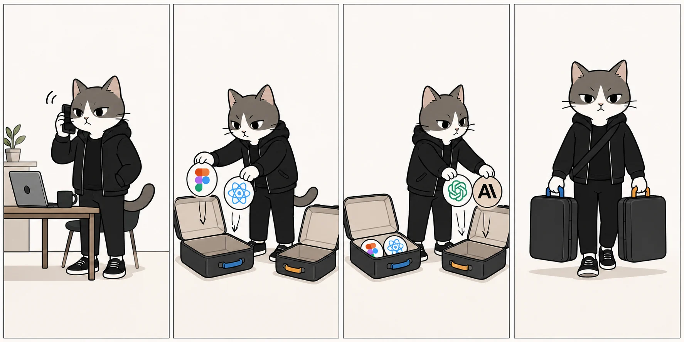

# kotikit



Create Figma-ready product drafts from plain language, using your real design
system.

AI can generate screens quickly, but product design is not just drawing boxes.
A useful UX/UI draft still needs product judgment, real components, edge
states, review loops, and a path toward implementation that does not break the
system.

kotikit is an experimental local-first toolkit for product designers, founders,
PMs, and teams who want to move from idea to Figma prototype faster without
becoming frontend engineers first.

It helps Claude Code, Codex, and other MCP-capable agents ask the right product
questions, sync your Figma design system, create safe draft pages, review the
result, remember repeated feedback, and keep the design process grounded in the
components your team actually uses.

## Demo

A 1-minute demo video will live here.

The demo will show kotikit taking a rough request like "build a members admin
page", asking clarifying questions, syncing a design system, creating a Figma
draft, then running a design review.

## Why It Exists

Everyone is being told to use AI for everything, including UX/UI design. But
the product designer role is not becoming obsolete. It is changing under
pressure: teams expect faster exploration, faster prototypes, and faster
handoff, while the work still needs taste, structure, accessibility, states,
constraints, and design-system discipline.

Most people can describe the screen they need, but cannot quickly turn that
description into a useful Figma draft. Product managers and founders can
explain a workflow, but often need help shaping it into a concrete screen.
Designers lose time on repetitive layouts, states, tables, forms, and review
loops. Engineers get pulled toward implementation before the product shape is
clear.

AI agents can help, but generic AI UI output usually has the same failures:

- It ignores the team's real design system.
- It invents components that do not exist.
- It produces layouts that look plausible until they land in Figma.
- It forgets feedback that the team repeats every week.

kotikit is an experiment in closing that gap: anyone should be able to describe
what they need, then let an agent use real Figma libraries, safe draft targets,
review comments, and local project memory to create something inspectable in
minutes.

The long-term goal is a safer path from product idea to Figma prototype and,
later, to implementation in frameworks like React. The current focus is the
design side: make the draft useful, reviewable, and grounded in the team's real
system before code generation becomes part of the guided workflow.

## Status

kotikit is a public alpha research project. The repository is public so people
can inspect the workflow, try it locally, and see where the idea is going.

It is not a mature open-source project yet:

- Public PRs are not being accepted right now.
- There is no support SLA.
- APIs, local file formats, and workflows may change.
- The project was built through AI-assisted/vibe-coded development and still
  needs deeper independent security, architecture, and production review.
- Use it for experiments, drafts, and controlled Figma files first.

Design-to-code is intentionally not part of the guided workflow yet. kotikit is
currently focused on stabilizing design creation, review, and design-system use.

## Who It Is For

- **Product designers** who want AI leverage for fast drafts, state coverage,
  design-system lookup, comment review, and iteration while they keep creative
  control.
- **Product managers and founders** who want to turn product intent into an
  inspectable Figma prototype without learning Figma deeply.
- **Engineers** who want design work to become structured before implementation
  starts.
- **Agent workflow builders** who want to study a local-first MCP and Figma
  workflow built from specs, SQLite indexes, assistant skills, and a Figma
  plugin bridge.

## What Works Today

- Guided screen and flow specification through Claude Code or Codex.
- Local specs under `.kotikit/specs`.
- Figma design-system sync into local SQLite indexes.
- Adaptive Figma API pacing and resumable sync for larger libraries.
- Component and icon search over the synced design system.
- Safe Figma draft page binding.
- Figma plugin bridge for applying generated design plans.
- Variable import fallback through the plugin for non-Enterprise Figma plans.
- Browserless Figma comment review.
- Standalone design-quality review for exact Figma targets.
- Optional posting of approved review comments back to Figma.
- Local design memory from repeated review adjustments.
- Assistant scaffold for Claude Code and Codex.

## What Does Not Work Yet

- Guided design-to-code is disabled.
- There is no polished npm, Homebrew, or global installer.
- The Figma plugin is functional but still young.
- The review workflow is useful, but not a replacement for a senior designer.
- Public contributions are not open yet.
- There is no formal security audit.

## How It Works

kotikit has four main pieces:

1. **MCP server**  
   Claude Code, Codex, and other MCP clients call `kotikit_*` tools.

2. **Local project state**  
   Specs, config, design review state, design memory, and bridge state live in
   the target project under `.kotikit`.

3. **Design-system indexes**  
   Figma components, icons, styles, and variables are synced into
   `design-system/` so agents can search instead of loading huge files into
   context.

4. **Figma plugin bridge**  
   The optional plugin connects the open Figma file to the local MCP server so
   kotikit can apply draft designs and import variables through Figma's Plugin
   API.

See [docs/architecture.md](docs/architecture.md) for the detailed system map.

## Safety Model

kotikit is designed to be local-first and conservative:

- No hosted backend is required.
- Your Figma token stays in your target project's `.env`.
- Large design-system data is stored locally and searched through SQLite.
- Figma design creation is blocked until you bind an exact draft page URL.
- The target Figma page name must contain `Draft` or `Drafts`.
- Generated screens are placed inside a kotikit-owned Figma Section.
- Apply-step logging validates file, page, and Section metadata.
- Figma review comments are never posted without explicit approval.

This does not make kotikit production-safe by itself. It gives the workflow
clear boundaries while the project is still alpha.

## Quick Start

Requirements:

- Bun.
- Claude Code, Codex, or another MCP-capable assistant.
- Figma's assistant integration for your assistant installed from inside Figma.
- A Professional, Organization, or Enterprise Figma account is recommended.
- A Figma personal access token with file read access.
- A local target project where kotikit can write `.kotikit/`, `design-system/`,
  and `.env`.

Minimal setup:

```bash
git clone https://github.com/captain-pink/kotikit.git ~/kotikit
cd ~/kotikit
bun install
bun run scaffold:agents -- --target /Users/YOUR_USERNAME/path/to/your-project --agents both
```

Then add your Figma token to the target project's `.env`:

```env
FIGMA_TOKEN=figd_...your_token_here...
```

Restart your assistant in the target project and run:

- Claude Code: `/kotikit-auto`
- Codex: `kotikit:auto`

For the full setup flow, see
[docs/getting-started.md](docs/getting-started.md).

## Common Workflows

- Sync a published Figma design system.
- Create or refine a Figma draft from a saved spec.
- Import variables through the Figma plugin when the REST Variables API is
  unavailable.
- Review Figma comments without opening a browser.
- Run a design-quality review on an exact page, section, frame, or component.
- Promote repeated feedback into local design memory.

See [docs/workflows.md](docs/workflows.md) for step-by-step examples.

## Figma Notes

Design-system sync is intended for published Figma libraries on paid Figma
plans. Free/Starter accounts have very low API limits for some file endpoints,
so even small sync jobs can be slow or unreliable.

kotikit can inspect some draft-file data, but generated Figma drafts need
importable component keys. Those keys come from published libraries. If you
point kotikit at an unpublished draft file, treat it as inspection or
experimentation, not as a usable design system for composing new drafts.

Variables through Figma's REST API are Enterprise-gated. On Professional or
Organization plans, kotikit guides you through the local Figma plugin flow when
variables or tokens are needed.

See [docs/figma.md](docs/figma.md) for token scopes, draft page rules, plugin
setup, and variable fallback details.

## Keeping Sessions Cheap

kotikit avoids dumping whole design systems into the assistant context. The
normal pattern is: search first, fetch exact component details second, and keep
review/design sessions focused.

See [docs/TOKENS.md](docs/TOKENS.md) for the detailed token-cost strategy.

## Roadmap

Near term:

- More reliable Figma draft creation across different design systems.
- Better design-review drilldown without large context payloads.
- Improved Figma plugin UX.
- Stronger component creation workflow for missing design-system pieces.
- Better variable and library import flows.

Later:

- Production-quality installer.
- Richer design-review reporting.
- Broader design-system normalizer fixture corpus.
- Design-to-code after design creation is stable.

Not promised:

- Hosted cloud service.
- Public plugin marketplace distribution.
- Public contribution process.
- Production design-to-code.

More detail lives in [NEXT_STEPS.md](NEXT_STEPS.md).

## Project Status And Contributions

This repository is public for visibility and experimentation.

Public contributions are not open yet. Please do not open PRs expecting review
or merge. The project needs more stabilization before it can responsibly accept
outside work.

Feedback is useful, but there is no issue triage process or support guarantee
right now.

## License

No open-source license is currently granted.

Until a `LICENSE` file is added, the repository is source-available for review
and local experimentation only. Do not assume permission to redistribute,
repackage, or use the code in a commercial product.

This may change later once the project is more stable and the intended public
license is chosen.

## Documentation

- [docs/getting-started.md](docs/getting-started.md) - install and first run.
- [docs/workflows.md](docs/workflows.md) - user-facing kotikit workflows.
- [docs/figma.md](docs/figma.md) - Figma setup, plugin, tokens, and safety.
- [docs/troubleshooting.md](docs/troubleshooting.md) - common problems.
- [docs/development.md](docs/development.md) - repo development workflow.
- [docs/architecture.md](docs/architecture.md) - system overview.
- [docs/tools.md](docs/tools.md) - complete MCP tool reference.
- [docs/agent_workflow.md](docs/agent_workflow.md) - shared Claude/Codex
  workflow.
- [docs/coding_guidelines.md](docs/coding_guidelines.md) - engineering style.
- [docs/TOKENS.md](docs/TOKENS.md) - token-cost strategy.
